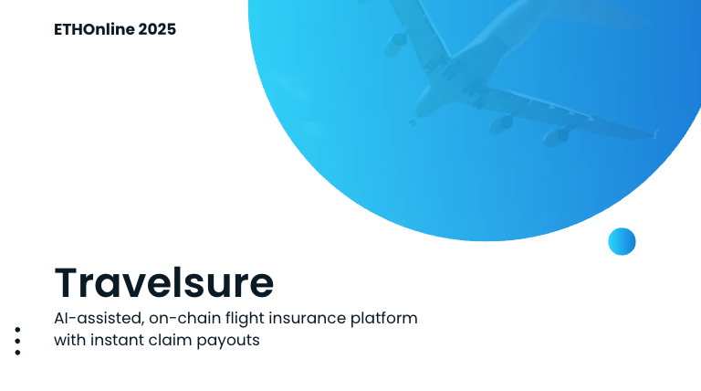

# Travelsure



**Shortlisted at ETHOnline 2025 — Top 15 % of Project Submissions 🏅**

Project Showcase: https://ethglobal.com/showcase/travelsure-roq07

**On-chain flight delay insurance powered by smart contracts and Chainlink oracles**

Travelsure is a decentralized insurance platform that provides instant payouts for flight delays using blockchain technology (smart contracts). No paperwork, no waiting, no claims process. When your flight is delayed, you get paid automatically.

## Overview

Travelsure revolutionizes travel insurance by leveraging Web3 technology to create a transparent, automated, and instant payout system for flight delays. The platform uses smart contracts and Chainlink oracles to verify flight status and execute payouts automatically when delays occur.

### Key Features

- **Instant Payouts**: Automatic payouts in PayPal USD when flight delays are verified
- **No Claims Process**: Smart contracts handle everything automatically
- **Transparent Terms**: All policy terms are recorded on-chain
- **AI-Powered Recommendations**: Intelligent agent suggests optimal coverage
- **Multi-Tier Coverage**: Basic, Silver, Gold, and Platinum policy tiers
- **Real-time Monitoring**: Chainlink Functions oracles track flight status continuously
- **Decentralized Verification**: Flight data verified through Chainlink's decentralized oracle network

### How It Works

1. **Buy Coverage**: Choose your flight and purchase coverage with a fixed premium. Your policy is recorded on-chain.
2. **Oracle Monitoring**: Decentralized oracles track flight status in real time and verify delays or cancellations.
3. **Instant Payout**: If a delay triggers your policy, funds are released immediately to your wallet.

## Architecture

### Smart Contracts
- **PolicyManager**: Core contract managing policies, payouts, and tier configurations (localhost)
- **PolicyManagerSepolia**: Sepolia testnet version with real Chainlink Functions integration
- **PYUSDMock**: Mock PayPal USD token for testing (localhost)
- **PYUSD (Official)**: Official PayPal USD token on Sepolia testnet
- **MockFunctionsRouter**: Chainlink Functions router for oracle integration (localhost)

### Frontend
- **Next.js 15**: Modern React framework with TypeScript
- **RainbowKit**: Web3 wallet connection
- **Wagmi**: Ethereum React hooks
- **Tailwind CSS**: Utility-first styling

### AI Agent
- **UAgents Framework**: Decentralized AI agent for insurance recommendations
- **Chat Protocol**: Direct communication with users
- **Flight Analysis**: Intelligent risk assessment and policy matching

## Project Structure

```
Travelsure/
├── contracts/          # Smart contracts (Hardhat)
│   ├── contracts/     # Solidity contracts
│   ├── test/          # Contract tests
│   ├── scripts/      # Deployment scripts
│   └── ignition/      # Hardhat Ignition modules
├── frontend/          # Next.js web application
│   ├── app/           # App router pages
│   ├── components/    # React components
│   └── lib/           # Utility functions
└── ai-agent/          # UAgents AI system
    ├── protocols/     # Agent communication protocols
    └── tests/         # Agent tests
```

## Technology Stack

### Blockchain
- **Solidity**: Smart contract development
- **Hardhat**: Development environment
- **Chainlink**: Oracle network for flight data
- **OpenZeppelin**: Standard libraries

### Frontend
- **Next.js 15**: React framework
- **TypeScript**: Type safety
- **Tailwind CSS**: Styling
- **RainbowKit**: Wallet connection
- **Wagmi**: Ethereum integration

### AI/Backend
- **UAgents**: Decentralized AI framework
- **Python**: Agent development
- **Chat Protocol**: User interaction

## Getting Started

### Prerequisites
- Node.js 18+ (recommended 20+)
- npm (or your preferred package manager)
- Python 3.8+ (for AI agent)

### Local Development Setup

#### 1) Start a local Hardhat node
Open a terminal and run the node inside the `contracts` workspace. Keep this terminal running.

```bash
cd contracts
npx hardhat node
```

By default this starts an RPC server on `http://127.0.0.1:8545` with chainId `31337`.

#### 2) Deploy contracts to localhost
In a second terminal, deploy using Hardhat Ignition while the node is running.

```bash
cd contracts
npx hardhat ignition deploy ./ignition/modules/PolicyStack.ts --network localhost
```

This deploys:
- `PYUSDMock`
- `MockFunctionsRouter`
- `PolicyManager` (wired to the router and PYUSDMock)

Deployment artifacts/addresses will be written under `contracts/ignition/deployments/` (e.g., `localhost-*`).

#### 3) Start the frontend
In a third terminal:

```bash
cd frontend
npm install
npm run dev
```

The app will start on `http://localhost:3000`.

#### 4) Start the AI agent (optional)
In a fourth terminal:

```bash
cd ai-agent
pip install -r requirements.txt
python insurance_agent_chat.py
```

### Available Scripts

#### Contracts
```bash
cd contracts
npm run node-localhost    # Start local node
npm run deploy-local      # Deploy to localhost
npm run simulate-fulfill  # Simulate oracle fulfillment
```

#### Frontend
```bash
cd frontend
npm run dev      # Development server
npm run build    # Production build
npm run start    # Production server
npm run lint     # Code linting
```

## Smart Contract Details

### PolicyManager Contract
The core contract that manages:
- Policy creation and management
- Tier-based pricing (Basic, Silver, Gold, Platinum)
- Automatic payout execution
- Oracle integration for flight status

### Policy Tiers
- **Basic**: Standard coverage with basic payout
- **Silver**: Enhanced coverage with higher payout
- **Gold**: Premium coverage with maximum payout
- **Platinum**: Ultimate coverage with highest payout

### Key Functions
- `purchasePolicy()`: Create new insurance policy
- `checkAndFulfill()`: Oracle-triggered payout execution
- `getPolicy()`: Retrieve policy details
- `getTierConfig()`: Get tier-specific configuration

## AI Agent Features

The Travelsure AI agent provides:
- **Personalized Recommendations**: Analyzes travel patterns and risk factors
- **Instant Suggestions**: Provides policy recommendations in seconds
- **Chat Interface**: Direct communication with users

## Testing

### Contract Testing
```bash
cd contracts
npx hardhat test
```

### Frontend Testing
```bash
cd frontend
npm run test
```

### AI Agent Testing
```bash
cd ai-agent
python -m pytest tests/
```

## Deployment

### Local Development
Follow the "Getting Started" section above for local development.

### Sepolia Testnet Deployment

#### Contract Addresses
- **PolicyManagerSepolia**: `0x855E81e27435F79A4145be74399DC992dB3C3ede`

Blockscout: `https://eth-sepolia.blockscout.com/address/0x855E81e27435F79A4145be74399DC992dB3C3ede?tab=contract`

- **PYUSD (Official)**: `0xCaC524BcA292aaade2DF8A05cC58F0a65B1B3bB9`
- **Chainlink Functions Router**: `0xb83E47C2bC239B3bf370bc41e1459A34b41238D0`
- **DON ID**: `0x66756e2d657468657265756d2d7365706f6c69612d3100000000000000000000`

### Chainlink Functions Subscription
https://functions.chain.link/sepolia/5796

#### Deployment Commands
```bash
cd contracts
npm run deploy-sepolia    # Deploy to Sepolia testnet
npm run add-consumer      # Add contract as Chainlink consumer
npm run test-sepolia      # Test deployment with Chainlink Functions
```

#### Prerequisites for Sepolia
1. **Environment Setup**: Copy `env.example` to `.env` and configure:
   - `SEPOLIA_RPC_URL`: Your Sepolia RPC endpoint
   - `SEPOLIA_PRIVATE_KEY`: Your wallet private key
   - `CHAINLINK_SUBSCRIPTION_ID`: Your Chainlink Functions subscription
   - `CHAINLINK_DON_ID`: Sepolia DON ID
   - `CHAINLINK_FUNCTIONS_ROUTER`: Sepolia Functions Router

2. **Funding Requirements**:
   - Sepolia ETH for gas fees
   - Chainlink Functions subscription with LINK balance
   - PYUSD tokens for testing (acquire from [Circle Faucet](https://faucet.circle.com/))

3. **Chainlink Functions Setup**:
   - Create subscription on [Chainlink Functions](https://functions.chain.link/)
   - Add contract as authorized consumer
   - Ensure sufficient LINK balance for oracle calls

### Production Deployment
1. Deploy contracts to your target network
2. Update frontend configuration with deployed contract addresses
3. Deploy frontend to your hosting platform
4. Configure AI agent for production environment

## Contributing

1. Fork the repository
2. Create a feature branch
3. Make your changes
4. Add tests for new functionality
5. Submit a pull request

## License

This project is licensed under the MIT License.

## Support

For questions and support, please open an issue in the repository.

## Notes
- Ensure the Hardhat node remains running while deploying and using the app
- If you need to redeploy fresh, stop the node, restart it, and re-run the deploy step
- The AI agent requires Python dependencies to be installed
- All contract interactions require a connected Web3 wallet

