# 🛡️ TravelSure AI Agent System

**ETHOnline 2025 - ASI Alliance Track Submission**

Intelligent flight insurance recommendation system powered by **Fetch.ai uAgents**, **SingularityNET MeTTa**, and **ASI:One** for autonomous, explainable insurance decisions.

## 🏆 ASI Alliance Integration

### Core Technologies

- **🤖 Fetch.ai uAgents**: Multi-agent orchestration and communication
- **� SingulariutyNET MeTTa**: Symbolic reasoning and knowledge graphs
- **💬 ASI:One Chat Protocol**: Human-agent interaction via Agentverse
- **🌐 Agentverse**: Agent hosting, discovery, and marketplace

### Hackathon Features

- ✅ **Multi-Agent Architecture**: 2 specialized autonomous agents
- ✅ **MeTTa Knowledge Graphs**: Structured insurance domain reasoning
- ✅ **ASI:One Chat Integration**: Direct human-agent conversation
- ✅ **Explainable AI**: Transparent decision-making with proofs
- ✅ **Real-time Data**: Live flight risk assessment

## 🏗️ Production Architecture (2 Active Agents)


## 📁 Project Structure

### 🤖 Core Agents

- `insurance_agent_chat.py` - **Main orchestrator** with ASI:One chat + MeTTa reasoning
- `flight-data-agent/flight_historical_agent.py` - **Flight intelligence** agent

### 🧠 MeTTa Integration

- `metta/knowledge.py` - **Insurance domain** knowledge graph
- `metta/insurance_rag.py` - **RAG system** for knowledge queries
- `metta/utils.py` - **ASI:One LLM** integration utilities
- `metta/test.py` - **MeTTa integration** test suite

### 🚀 Deployment & Testing

- `deploy_agent_chat_insurance.py` - **Insurance agent** deployment
- `protocols/chat_protocol.py` - **ASI:One chat** protocol implementation
- `tests/` - **Comprehensive** test suite

### 📚 Documentation

- `README.md` - **Main** architecture overview
- `metta/README.md` - **MeTTa** integration guide
- `flight-data-agent/README.md` - **Flight agent** documentation

## � Deployed Agent Addresses

### Main Insurance Agent

**TravelSure Insurance Advisor** (Deployed on Render)

- **Address**: `agent1qwl7yawp0jrkxn90y45l8ta0c5xx2zty7dzz7n5nyjw2vqzf5f5jq38ah3t`
- **Inspector**: https://agentverse.ai/inspect/?uri=http%3A//127.0.0.1%3A8000&address=agent1qwl7yawp0jrkxn90y45l8ta0c5xx2zty7dzz7n5nyjw2vqzf5f5jq38ah3t
- **Chat Interface**: Use ASI:One Chat in Agentverse

### Flight Data Agents

**TravelSure Flight Historical Agent**

- **Address**: `agent1q2zezue4jw024qrr7q22f40zcufp593rhnzwya7el2cn8kz5kas7zxmcrdn`
- **Purpose**: Analyzes historical flight performance and delay statistics

### Integration Reference

For developers integrating with the TravelSure system:

```python
# Main Insurance Agent (Deployed on Render)
INSURANCE_AGENT = "agent1qwl7yawp0jrkxn90y45l8ta0c5xx2zty7dzz7n5nyjw2vqzf5f5jq38ah3t"

FLIGHT_HISTORICAL_AGENT = "agent1q2zezue4jw024qrr7q22f40zcufp593rhnzwya7el2cn8kz5kas7zxmcrdn"
```

## �🚀 Quick Start

### 1. Install Dependencies

```bash
pip install -r requirements.txt
```

**Installs:**

- `uagents>=0.20.1` - Fetch.ai agent framework
- `uagents-core>=0.1.3` - ASI:One chat protocol
- `hyperon>=0.1.12` - SingularityNET MeTTa engine
- `aiohttp>=3.9.0` - Async HTTP for API calls
- `python-dotenv>=1.0.0` - Environment management

### 2. Set Environment Variables

Create `.env` file:

```bash
# Required for Agentverse deployment
AGENTVERSE_API_TOKEN="your_agentverse_token"

# Optional: ASI:One LLM integration
ASI_ONE_API_KEY="your_asi_one_key"
```

**Get API Keys:**

- Agentverse: https://agentverse.ai/profile/api-keys
- ASI:One: https://asi1.ai/

### 3. Test MeTTa Integration

```bash
cd metta
python test.py
```

Expected output:

```
🧪 TRAVELSURE METTA INTEGRATION TESTS
✅ Knowledge graph initialized successfully
✅ Insurance recommendations working
✅ ALL TESTS PASSED!
```

### 4. Deploy Agents

```bash
# Deploy flight historical agent
cd flight-data-agent
python flight_historical_agent.py

# Deploy main insurance agent (in new terminal)
cd ..
python deploy_agent_chat_insurance.py
```

### 5. Test in Agentverse Chat (ASI:One)

**Option A: Use Deployed Agent (Recommended)**

1. Go to https://agentverse.ai/agents
2. Search for address: `agent1qwl7yawp0jrkxn90y45l8ta0c5xx2zty7dzz7n5nyjw2vqzf5f5jq38ah3t`
3. Click **"Chat"** tab (ASI:One integration)
4. Try: `"Check flight AA100 on 2025-10-25"`

**Option B: Use Local Development Agent**

1. Go to https://agentverse.ai/agents
2. Find **"TravelSure-Insurance-Advisor"** (your local instance)
3. Click **"Chat"** tab
4. Try queries as above

**Sample Chat:**

```
User: "I need insurance for flight AA100 tomorrow"

Agent: "⏱️ Insurance Recommendation for Flight AA100

🧠 MeTTa Analysis:
✓ Historical performance: 75% on-time (MEDIUM risk)
✓ Route analysis: JFK → LHR (busy airports)

💡 Recommendation: Silver Tier (6h threshold)
Premium: $45.50 | Payout: $150

Reasoning: Flight shows moderate reliability.
6-hour threshold provides optimal coverage for this risk profile."
```

## 💬 ASI:One Chat Commands

### Flight Insurance Queries

```
"Check flight AA100 on 2025-10-25"
"I need insurance for UA890 tomorrow"
"Analyze BA001 today"
"What's the risk for DL456?"
"Should I get insurance for my flight?"
```

### MeTTa Knowledge Queries

```
"How does flight insurance work?"
"What are the different coverage types?"
"Explain delay risks"
"What factors affect premiums?"
"How do smart contracts work?"
```

### General Interaction

```
"hello" / "hi" / "hey"
"help"
"explain your reasoning"
"show me the proof"
```

## � EnIhanced Response Format (with MeTTa)

````
⏱️ Insurance Recommendation for Flight AA100

🧠 MeTTa Symbolic Analysis:
┌─────────────────────────────────────────────────────────────┐
│ KNOWLEDGE GRAPH REASONING                                   │
│ ✓ Flight performance: 75% on-time → MODERATE risk level    │
│ ✓ Route pattern: Transatlantic → STANDARD delay patterns   │
│ → RECOMMENDATION: delay_6h (Silver tier)                   │
└─────────────────────────────────────────────────────────────┘

Flight Intelligence:
✈️ AA100 | JFK → LHR | New York → London
📅 2025-10-25 🕐 20:30 departure
📊 Historical: 75.0% on-time (57/76 flights)

Risk Assessment:
┌─────────────────────────────────────────────────────────────┐
│ 🛩️ Flight Agent:    MEDIUM risk (25% delay probability)    │
│ 🧠 MeTTa Engine:    MODERATE overall risk                  │
│ 🎯 Final Decision:  Silver Tier (6h threshold)             │
└─────────────────────────────────────────────────────────────┘

Insurance Options (Smart Contract Pricing):

💎 Platinum (2h): $280.88 → $500 payout
   MeTTa: "Best for excellent flights (>85% on-time)"

🥇 Gold (4h): $101.76 → $250 payout
   MeTTa: "Good for reliable flights (75-85% on-time)"

🥈 Silver (6h): $45.50 → $150 payout ⭐ RECOMMENDED
   MeTTa: "Optimal for moderate reliability (65-75%)"
   ✓ Matches flight performance profile

🥉 Basic (8h): $18.25 → $75 payout
   MeTTa: "Budget option for unreliable flights"

� Explainabele AI Proof:
```metta
(flight_performance AA100 0.75)
(route_type transatlantic standard)
(airport_congestion JFK moderate)
→ (recommend delay_6h "balanced coverage for moderate risk")
````

💡 Confidence: 85% | Reasoning: Transparent | Verifiable: ✅

````

## 🧠 MeTTa Symbolic Reasoning Engine

### Knowledge Graph Structure

```metta
; Insurance domain knowledge
(insurance_type delay_2h "2-hour threshold")
(best_for delay_2h "highly reliable flights with on-time rate > 85%")
(premium_multiplier delay_2h "0.3")

; Risk assessment rules
(risk_level excellent "on-time rate > 85%, recommend 2h threshold")
(risk_level good "on-time rate 75-85%, recommend 4h threshold")
(risk_level moderate "on-time rate 65-75%, recommend 6h threshold")
````

### Multi-Agent Risk Calculation

```python
# Flight Historical Agent
flight_risk = 1.0 - ontime_percent

# MeTTa Reasoning
final_recommendation = metta_rag.get_recommendation_by_ontime_rate(
    ontime_percent, route_type, airport_factors
)
```

### Risk Levels (Enhanced)

- **🟢 LOW** (< 0.15): Excellent performance, minimal risk
- **🟡 MEDIUM** (0.15 - 0.30): Moderate delays, some risk factors
- **🟠 HIGH** (0.30 - 0.50): Frequent delays, significant concerns
- **� SiEVERE** (> 0.50): Poor reliability, high risk

### MeTTa Decision Proofs

Every recommendation includes symbolic reasoning proof:

```mermaid
flowchart TD
    A[Flight Data Input<br/>AA100: 75% on-time] --> B{MeTTa Knowledge Graph}

    B --> C[Query Risk Level<br/>75% → moderate]
    B --> D[Query Insurance Types<br/>delay_2h, delay_4h, delay_6h...]
    B --> E[Query Best Practices<br/>moderate → 6h threshold]

    C --> F[Risk Assessment Rules]
    D --> F
    E --> F

    F --> G{Symbolic Reasoning<br/>Pattern Matching}

    G --> H[Match Pattern:<br/>flight_performance ∧ moderate_risk]
    H --> I[Apply Rule:<br/>recommend delay_6h]
    I --> J[Generate Proof:<br/>Explainable Decision]

    J --> K[Final Recommendation<br/>Silver Tier + Reasoning]

    classDef input fill:#e3f2fd,stroke:#1976d2
    classDef process fill:#f3e5f5,stroke:#7b1fa2
    classDef decision fill:#e8f5e8,stroke:#388e3c
    classDef output fill:#fff3e0,stroke:#f57c00

    class A input
    class B,C,D,E,F,G,H,I process
    class J decision
    class K output
```



**Symbolic Logic Example:**

```metta
!(match &self (and
    (flight_performance $flight $rate)
    (< $rate 0.80)
    (> $rate 0.65)
) (recommend delay_6h "moderate risk flight"))
```

## 📡 Agent Communication Protocol

### Message Flow Sequence

```mermaid
sequenceDiagram
    participant U as 👤 User
    participant IA as 🎯 Insurance Agent
    participant M as 🧠 MeTTa Engine
    participant FHA as 🛩️ Flight Agent
    participant SAPI as 📅 Schedule API
    participant QAPI as 📊 Quote API

    U->>IA: ChatMessage<br/>"Check flight AA100 on 2025-10-25"
    IA->>M: Parse query & extract entities
    M-->>IA: airline="AA", flight="100", date="2025-10-25"

    IA->>FHA: FlightHistoricalRequest<br/>{airline, flight_number, date}

    par Parallel API Calls
        FHA->>SAPI: GET /schedule/AA/100/2025-10-25
        FHA->>QAPI: GET /quote/AA/100
    and
        SAPI-->>FHA: Schedule data<br/>{departure, arrival, route}
        QAPI-->>FHA: Historical stats<br/>{ontime_percent, delays, cancellations}
    end

    FHA->>FHA: Calculate risk score<br/>Analyze performance
    FHA-->>IA: FlightHistoricalResponse<br/>{success, ontime_percent, risk_score, ...}

    IA->>M: Apply symbolic reasoning<br/>Generate recommendation
    M->>M: Query knowledge graph<br/>Match risk patterns
    M-->>IA: Recommendation + Proof<br/>{type, confidence, reasoning}

    IA-->>U: Enhanced ChatMessage<br/>Comprehensive analysis + MeTTa proof
```



### Message Models

**FlightHistoricalRequest:**

```python
{
  "airline": "AA",
  "flight_number": "100",
  "date": "2025-10-25"
}
```

**FlightHistoricalResponse:**

```python
{
  "success": true,
  "ontime_percent": 0.75,
  "delay_risk": "MEDIUM",
  "risk_score": 0.25,
  "recommendation": "moderate reliability flight"
}
```

5. **MeTTa Knowledge Integration**

   - Combines flight data with domain knowledge
   - Applies symbolic reasoning rules
   - Generates explainable recommendations

6. **Insurance Agent → User** (Enhanced ChatMessage)
   - Comprehensive analysis with proofs
   - Risk assessment with reasoning
   - Transparent decision explanation

## 🧪 Testing

### Test Known Flights

```python
# American Airlines 100 (JFK → LHR)
"AA100 on 2025-10-25"  # Good historical data

# United 890 (SFO → SYD)
"UA890 tomorrow"  # Long-haul international

# British Airways 1 (LHR → JFK)
"BA001 today"  # Reliable transatlantic
```

### Expected Results

- ✅ Schedule data fetched from FlightDelay API
- ✅ Historical stats (76+ flights analyzed)
- ✅ Risk assessment (LOW/MEDIUM/HIGH)
- ✅ MeTTa symbolic reasoning proofs
- ✅ Smart contract pricing integration
- ✅ Insurance recommendation with confidence

## 🐛 Troubleshooting

### Agent Not Responding

```bash
# Check if agents are running
# Go to: https://agentverse.ai/agents
# Verify both agents show green status
```

### "Unable to analyze flight"

```bash
# Try a well-known flight:
"AA100 on 2025-10-25"

# Verify date format: YYYY-MM-DD
```

### MeTTa Integration Issues

```bash
# Test MeTTa separately
cd metta
python test.py

# Check MeTTa installation
pip install hyperon>=0.1.12
```

## 🏆 ETHOnline 2025 - ASI Alliance Track

### Hackathon Achievements ✅

**1st Place Criteria - ASI:One + MeTTa Integration:**

- ✅ **ASI:One Chat Protocol**: Direct human-agent conversation in Agentverse
- ✅ **MeTTa Symbolic Reasoning**: Knowledge graphs for explainable decisions
- ✅ **Real-world Impact**: Solves actual flight insurance problem
- ✅ **Creative Implementation**: Multi-agent coordination with flight intelligence

**2nd Place Criteria - Agentverse Launch:**

- ✅ **Discoverable via ASI:One**: Easy to find and interact with
- ✅ **Clear Purpose**: Flight insurance recommendation system
- ✅ **MeTTa-Powered Logic**: Transparent reasoning explanations
- ✅ **Professional Presentation**: Comprehensive documentation

**3rd Place Criteria - Multi-Agent System:**

- ✅ **2 Specialized Agents**: Insurance orchestrator + Flight intelligence
- ✅ **Smooth Communication**: Efficient message protocols
- ✅ **Shared Knowledge**: MeTTa knowledge graphs
- ✅ **Complex Task Coordination**: Real-time data + symbolic reasoning

### Technical Innovation Stack


### Scalability & Future

- **Cross-chain Integration**: Ready for blockchain insurance contracts
- **Agent Marketplace**: Discoverable via Agentverse
- **Knowledge Evolution**: MeTTa graphs can learn and adapt
- **Enterprise Ready**: Production-grade multi-agent architecture

## 📚 ASI Alliance Resources

- **🌐 Agentverse**: https://agentverse.ai - Agent hosting & discovery
- **🤖 Fetch.ai Docs**: https://fetch.ai/docs - uAgents framework
- **🧠 MeTTa**: https://metta-lang.dev - Symbolic reasoning engine
- **💬 ASI:One**: https://asi1.ai - LLM & chat protocol
- **🔗 SingularityNET**: https://singularitynet.io - AI marketplace

## 🎯 Demo Instructions

### For Judges - Quick Test

1. **Visit Agentverse**: https://agentverse.ai/agents
2. **Find Agent**: Search "TravelSure-Insurance-Advisor"
3. **Click Chat**: Use ASI:One integration
4. **Try Query**: `"Check flight AA100 on 2025-10-25"`
5. **Observe**: Multi-agent coordination + MeTTa reasoning

### Expected Demo Flow

```
User: "I need insurance for flight AA100 tomorrow"

🤖 Insurance Agent: Parsing flight query...
🛩️ Flight Agent: Fetching historical data...
🧠 MeTTa Engine: Applying symbolic reasoning...

Result: Comprehensive recommendation with explainable proof
```

---

**Status:** 🚀 **Production Ready** - 2 agents deployed with MeTTa integration  
**Achievement:** ✅ **Full ASI Alliance Stack** - uAgents + MeTTa + ASI:One  
**Impact:** 🎯 **Real-world Solution** - Intelligent flight insurance automation
