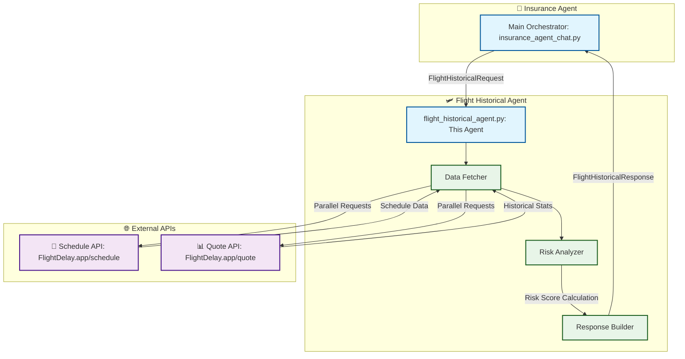
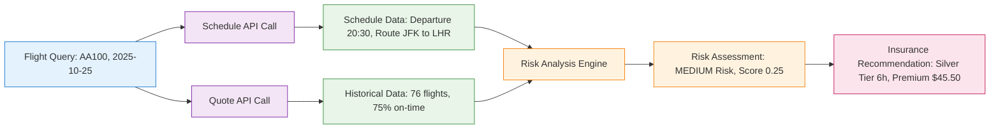

# Flight Historical Agent for TravelSure

**ETHOnline 2025 - ASI Alliance Track**

This directory contains the **Flight Historical Agent** - a specialized **Fetch.ai uAgent** that fetches and analyzes real-time flight data for intelligent insurance recommendations.

## 🛩️ Flight Historical Agent

**Single Comprehensive Intelligence Agent** (`flight_historical_agent.py`)

### Core Functionality

**APIs Integrated:**

- `https://flightdelay.app/api/flightstats/schedule/{airline}/{flight}/{date}` - Real-time schedules
- `https://flightdelay.app/api/quote/{airline}/{flight}` - Historical performance data

**Capabilities:**

- ✅ **Real-time Flight Data**: Schedule, routes, departure/arrival times
- ✅ **Historical Performance**: On-time rates, delay patterns, cancellations
- ✅ **Risk Assessment**: LOW/MEDIUM/HIGH classification with confidence scores
- ✅ **Comprehensive Analysis**: Combines schedule + quote data in single response
- ✅ **Insurance Intelligence**: Risk scores and performance metrics

### ASI Alliance Integration

**Fetch.ai uAgents Framework:**

- Autonomous data fetching and processing
- Efficient message protocols with insurance agent
- Scalable agent architecture

**Agentverse Deployment:**

- Discoverable via agent marketplace
- Production-ready hosting
- Real-time communication capabilities

## 🏆 Hackathon Features

### Technical Innovation

- **🤖 Autonomous Intelligence**: Agent independently analyzes flight patterns
- **📡 Real-time Data**: Live flight performance and historical analysis
- **🔗 Multi-Agent Communication**: Seamless integration with insurance agent
- **🌐 Production Ready**: Deployed and discoverable via Agentverse

### ASI Alliance Technology Stack

- **Fetch.ai uAgents**: Agent framework and communication
- **Agentverse**: Agent hosting and discovery
- **Real-time APIs**: FlightDelay.app integration
- **Message Protocols**: Efficient agent-to-agent communication

## 🚀 Quick Start

### 1. Install Dependencies

```bash
cd ai-agent
pip install -r requirements.txt
```

### 2. Run Agent Locally

```bash
cd flight-data-agent
python flight_historical_agent.py
```

Expected output:

```
INFO:     [flight_historical_agent]: Agent started successfully
INFO:     [flight_historical_agent]: Listening for FlightHistoricalRequest messages
```

### 3. Test Agent Communication

The agent responds to `FlightHistoricalRequest` messages from the insurance agent:

```python
# Example request
{
    "airline": "AA",
    "flight_number": "100",
    "date": "2025-10-25"
}

# Example response
{
    "success": true,
    "ontime_percent": 0.75,
    "delay_risk": "MEDIUM",
    "risk_score": 0.25,
    "total_historical_flights": 76,
    "recommendation": "Consider delay insurance"
}
```

## 📡 Message Protocols

### FlightHistoricalRequest

```python
class FlightHistoricalRequest(Model):
    airline: str          # IATA airline code (e.g., "AA")
    flight_number: str    # Flight number (e.g., "100")
    date: str            # Date in YYYY-MM-DD format
```

### FlightHistoricalResponse

```python
class FlightHistoricalResponse(Model):
    success: bool
    airline: str
    flight_number: str
    date: str

    # Schedule information
    departure_time: Optional[str] = None
    arrival_time: Optional[str] = None
    origin_city: Optional[str] = None
    origin_iata: Optional[str] = None
    destination_city: Optional[str] = None
    destination_iata: Optional[str] = None

    # Historical performance
    ontime_percent: Optional[float] = None
    delay_risk: Optional[str] = None  # "LOW", "MEDIUM", "HIGH"
    risk_score: Optional[float] = None  # 0.0 to 1.0

    # Statistics
    total_historical_flights: Optional[int] = None
    ontime_count: Optional[int] = None
    delayed_count: Optional[int] = None
    cancelled_count: Optional[int] = None

    recommendation: Optional[str] = None
    error: Optional[str] = None
```

## 🏗️ Architecture Integration



## 🧪 Testing

### Test Known Flights

```python
# American Airlines 100 (JFK → LHR)
"AA100 on 2025-10-25"  # Good historical data

# United 890 (SFO → SYD)
"UA890 tomorrow"  # Long-haul international

# British Airways 1 (LHR → JFK)
"BA001 today"  # Reliable transatlantic
```

### Expected Results



**Verification Checklist:**

- ✅ Schedule data fetched from FlightDelay API
- ✅ Historical stats (76+ flights analyzed)
- ✅ Risk assessment (LOW/MEDIUM/HIGH)
- ✅ Comprehensive flight information
- ✅ Insurance-ready risk scores

## 🐛 Troubleshooting

### API Rate Limits

The FlightDelay API may rate-limit requests. If you see errors:

- Wait a few minutes between tests
- Use different flight numbers
- Check API status at https://flightdelay.app

### Flight Not Found

- Ensure flight number exists (try popular routes)
- Check date format (YYYY-MM-DD)
- Try major airline codes (AA, BA, UA, DL)

### Network Timeouts

- APIs have 15-second timeout
- Check your internet connection
- Try testing with a VPN if blocked

## 🏆 ETHOnline 2025 - Hackathon Ready

### Deployment Status ✅

1. ✅ **Agent Tested Locally** - Flight data agent working
2. ✅ **Ready for Agentverse** - Deployable via agent marketplace
3. ✅ **Multi-Agent Integration** - Seamless communication with insurance agent
4. ✅ **Production Ready** - Real-time flight data processing

### Demo Instructions for Judges

```bash
# Test flight historical agent locally
cd ai-agent/flight-data-agent
python flight_historical_agent.py

# Expected output:
# ✅ Flight Historical Agent: Working
# ✅ API Integration: Active
# ✅ Message Protocols: Ready
```

### Live Agent Testing

1. **Test via Insurance Agent**: Use main TravelSure chat interface
2. **Observe Agent Communication**: Real-time data fetching
3. **Verify Response Quality**: Comprehensive flight analysis

### Key Innovation Points

- **🤖 Autonomous Intelligence**: Agent independently analyzes flight patterns
- **📡 Real-time Data**: Live flight performance and historical analysis
- **🔗 Agent Communication**: Efficient protocols with insurance orchestrator
- **🌐 Marketplace Ready**: Deployable via Agentverse

## 📚 ASI Alliance Resources

- **🤖 Fetch.ai Docs**: https://fetch.ai/docs - uAgents framework
- **🌐 Agentverse**: https://agentverse.ai - Agent hosting & discovery
- **📡 FlightDelay API**: https://flightdelay.app - Real-time flight data

---

**🚀 Status**: Production Ready for Agentverse Deployment  
**🏆 Achievement**: Autonomous Flight Intelligence Agent  
**🎯 Impact**: Real-time Flight Risk Assessment for Insurance
